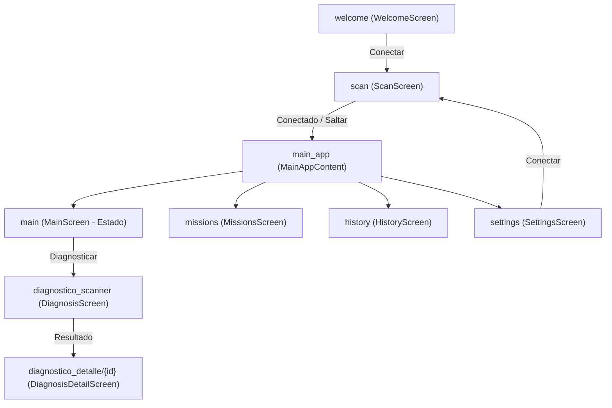
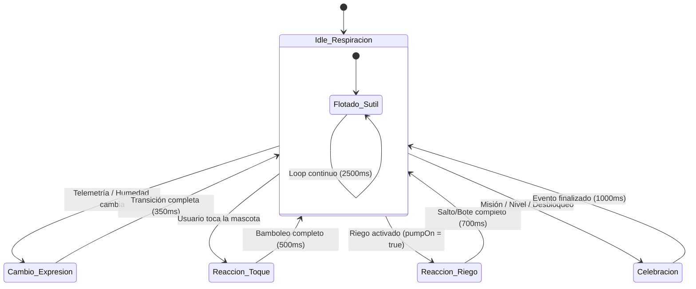

# Informe de Auditoría de Rendimiento y Arquitectura para Animaciones
**Proyecto:** Jardín Inteligente (`com.example.appjardin`)  
**Fecha:** Octubre 2026  
**Versión Base:** Commit `a8f4ea3` (*"V2: CONFIRM"*)  
**Estado:** Documento de Solo Lectura / Análisis Técnico Pre-Implementación  

---

## 1. Arquitectura y Flujo General

### 1.1 Mapa de Módulos y Estructura de Paquetes
La aplicación es un proyecto Android nativo monomódulo (`:app`), estructurado bajo el paquete principal `com.example.appjardin` ([build.gradle.kts:8](file:///D:/Projects%20Android/AppJardinInteligente-main/app/build.gradle.kts#L8)):

* `com.example.appjardin`
  * `ble/`: Administrador de conectividad Bluetooth Low Energy (`BleManager.kt`).
  * `data/`: Repositorio central (`Repository.kt`), base de datos Room (`local/AppDatabase.kt`, `Daos.kt`, `Entities.kt`) y gestión DataStore (`datastore/SettingsDataStore.kt`, `TestStartingBalance.kt`).
  * `domain/ai/`: Inferencia de salud vegetal con LiteRT/TFLite (`LiteRtDiagnosisClassifier.kt`, `ImagePreprocessor.kt`, `Postprocessor.kt`).
  * `model/`: Modelos de dominio (`Pet.kt`, `GameConfig.kt`, `MoistureState.kt`, `Telemetry.kt`).
  * `ui/`:
    * `components/`: Componentes reutilizables (`CircularGauge.kt`, `FullScreenArtBackground.kt`).
    * `screens/`: Pantallas principales (`WelcomeScreen.kt`, `ScanScreen.kt`, `MainScreen.kt`, `MissionsScreen.kt`, `HistoryScreen.kt`, `SettingsScreen.kt`, `DiagnosisScreen.kt`, `DiagnosisDetailScreen.kt`, `PetCongratulationsDialog.kt`, `DiagnosisHistoryCard.kt`).
    * `theme/`: Paleta de colores, tipografía y estilos (`Color.kt`, `Theme.kt`).
  * `util/`: Utilidades auxiliares (`HumidityUtils.kt`, `PetFactUtils.kt`, `PlantImageStorage.kt`).
  * `viewmodel/`: Lógica de presentación (`GardenViewModel.kt`, `DiagnosisViewModel.kt`).

### 1.2 Dependencias Técnicas y Librerías de Animación
Según [gradle/libs.versions.toml](file:///D:/Projects%20Android/AppJardinInteligente-main/gradle/libs.versions.toml) y [app/build.gradle.kts](file:///D:/Projects%20Android/AppJardinInteligente-main/app/build.gradle.kts):

* **Kotlin:** `2.1.0` (Plugin de compilador de Compose `2.1.0`).
* **Android Gradle Plugin (AGP):** `9.4.1`.
* **minSdk:** `24` | **targetSdk / compileSdk:** `35`.
* **Jetpack Compose BOM:** `2025.01.00` (Compose UI 1.7+, Material 3 1.3+).
* **Navigation Compose:** `2.8.5`.
* **Coil:** `io.coil-kt:coil-compose:2.7.0`.
* **CameraX:** `1.4.1`.
* **LiteRT (TFLite):** `1.0.1` (`com.google.ai.edge.litert:litert:1.0.1`).
* **Room:** `2.8.5` (KSP `2.1.0-1.0.29`).
* **DataStore Preferences:** `1.1.2`.
* **Librerías de Animación Externas (Lottie / Rive):** **NO EXISTEN** en las dependencias actuales del proyecto. Toda la animación existente se basa en las APIs nativas de Jetpack Compose (`androidx.compose.animation`).

### 1.3 Grafo de Navegación y Barras del Sistema
El grafo principal está definido mediante `NavHost` en `MainActivity.kt` ([MainActivity.kt:108-168](file:///D:/Projects%20Android/AppJardinInteligente-main/app/src/main/java/com/example/appjardin/MainActivity.kt#L108-L168)):



* **Transiciones de Navegación:** Transiciones por defecto de `navigation-compose` (sin animaciones custom de entrada/salida entre rutas).
* **Manejo Edge-to-Edge y Barras del Sistema:**
  * `enableEdgeToEdge()` activado en `MainActivity.onCreate()` ([MainActivity.kt:47](file:///D:/Projects%20Android/AppJardinInteligente-main/app/src/main/java/com/example/appjardin/MainActivity.kt#L47)).
  * `DisposableEffect` en `WelcomeScreen.kt`, `ScanScreen.kt`, `MainAppContent` y `MainScreen.kt` gestiona la apariencia transparente de las barras de estado e insets de navegación (`isAppearanceLightStatusBars`, `isAppearanceLightNavigationBars`), restaurando el estado previo al salir.

### 1.4 Flujo de Arranque
1. `MainActivity.onCreate()` llama a `enableEdgeToEdge()` e inicia la navegación en la ruta `"welcome"`.
2. `WelcomeScreen` muestra la ilustración `fb2.png` a pantalla completa.
3. Al presionar *"Conectar Jardín Inteligente"*, navega a `"scan"` (`ScanScreen`).
4. `ScanScreen` busca dispositivos BLE. El usuario puede:
   * Conectarse a un ESP32 $\rightarrow$ conmuta a `ConnectionMode.CONNECTED` y navega a `"main_app"`.
   * Presionar *"Saltar"* $\rightarrow$ invoca `viewModel.skipToOfflineMode()`, conmuta a `ConnectionMode.OFFLINE` y navega a `"main_app"`.

---

## 2. Estado y Datos: La Fuente de las Animaciones

### 2.1 Inventario de Estados Expuestos por ViewModels

#### `GardenViewModel.kt` ([GardenViewModel.kt:32-200](file:///D:/Projects%20Android/AppJardinInteligente-main/app/src/main/java/com/example/appjardin/viewmodel/GardenViewModel.kt#L32-L200)):
* `telemetry: SharedFlow<Telemetry?>` (proviene de `BleManager` vía notificaciones BLE GATT, emite en `Dispatchers.IO` cada ~2 segundos).
* `connectionState: StateFlow<Int>` (`BluetoothProfile.STATE_DISCONNECTED`, `CONNECTING`, `CONNECTED`).
* `connectionMode: StateFlow<ConnectionMode>` (`CONNECTED` vs `OFFLINE`).
* `selectedPlant: StateFlow<PlantEntity?>` (planta seleccionada en Room/DataStore).
* `lastSessionForSelectedPlant: StateFlow<SessionEntity?>` (última sesión de la planta para lectura de humedad offline).
* `selectedPet: StateFlow<Pet>` (enum de la mascota equipada).
* `petNames: StateFlow<Map<String, String>>` (mapa de especie ID $\rightarrow$ nombre personalizado).
* `coins: StateFlow<Int>`, `exp: StateFlow<Int>`, `level: StateFlow<Int>` (economía del juego).
* `unlockedPets: StateFlow<Set<String>>` (conjunto de especies desbloqueadas).
* `pumpOn: StateFlow<Boolean>` (estado de la bomba de riego).
* `claimedMissionsMap: StateFlow<Map<String, Boolean>>` (mapa de misiones reclamadas).

#### `DiagnosisViewModel.kt`:
* `isAnalyzing: StateFlow<Boolean>` (estado de inferencia con TFLite/LiteRT).
* `analysisResult: StateFlow<DiagnosisResult?>` (resultado de clasificación).

### 2.2 Derivación del Estado de Humedad
Calculado mediante `viewModel.getMoistureState(humidity, plant)` ([GardenViewModel.kt:225-236](file:///D:/Projects%20Android/AppJardinInteligente-main/app/src/main/java/com/example/appjardin/viewmodel/GardenViewModel.kt#L225-L236)):

* `LOW_MOISTURE` si `humidity < plant.humedadMinima` $\rightarrow$ Color: `ColorLowMoisture` (`#E53935`).
* `MEDIUM_MOISTURE` si `humidity < plant.humedadBuena` $\rightarrow$ Color: `ColorMediumMoisture` (`#FF9800`).
* `GOOD_MOISTURE` si `humidity <= plant.humedadExceso` $\rightarrow$ Color: `ColorGoodMoisture` (`#4CAF50`).
* `EXCESS_MOISTURE` si `humidity > plant.humedadExceso` $\rightarrow$ Color: `ColorExcessMoisture` (`#D32F2F`).
* `NO_PLANT` si `plant == null` $\rightarrow$ Color: `ColorVerdeAlegre` (`#00C853`).

**Frecuencia de Actualización:**
* En modo conectado: Cada ~2 segundos cuando llega un paquete de telemetría BLE.
* En modo sin dispositivo: Estático (humedad final de la última sesión guardada en Room).

### 2.3 Modelo del Estado de la Bomba y Riego
* Estado expuesto: `pumpOn: StateFlow<Boolean>`.
* Al presionar *"REGAR"*: `viewModel.togglePump(true)` establece optimistamente `_pumpOn.value = true` y envía el comando BLE `{"accion":"regar"}`.
* Al recibir notificaciones BLE, `telemetry.collect` confirma `_pumpOn.value = tele.bomba`.
* Si la humedad supera `humedadExceso` o se pierde la conexión, el riego se detiene automáticamente.

### 2.4 Eventos de Una Sola Vez (Unicos)

| Evento de UI | Implementación Actual | Estado para Animación |
| :--- | :--- | :--- |
| **Desbloqueo de Mascota** | `unlockedPetForCongratulations` en `SettingsScreen.kt` (`rememberSaveable`) | Disponible vía UI State |
| **Apertura de Cofre** | `chestRewardDialogData` en `MissionsScreen.kt` (`mutableStateOf`) | Disponible vía UI State |
| **Reclamo de Misión** | Callback de éxito con Toast en UI | Disponible vía UI State |
| **Conexión Perdida** | `showDisconnectDialog` en `MainActivity.kt` (`LaunchedEffect`) | Disponible vía UI State |
| **Subida de Nivel (Level Up)** | **No existe evento explicito** (cambia el número en DataStore) | **Refiere creación** (`SharedFlow<Int>`) |
| **Inicio/Fin de Riego** | Cambia `pumpOn: StateFlow<Boolean>` | Disponible vía StateFlow |
| **Diagnóstico Finalizado** | Cambia `analysisResult: StateFlow<DiagnosisResult?>` | Disponible vía StateFlow |
| **Toque a la Mascota** | **No existe** (sin interacción táctil) | **Requiere creación** (`onClick` en `Image`) |

---

## 3. Mascotas (Sección Central)

### 3.1 Formato y Ubicación de Assets
Todos los recursos de mascotas son archivos PNG ubicados en `app/src/main/res/drawable/`. Existen exactamente 30 archivos (6 especies $\times$ 5 expresiones):

```
app/src/main/res/drawable/
├── pet_larva_[asustado|enojado|feliz|triste|neutral].png
├── pet_gusano_[asustado|enojado|feliz|triste|neutral].png
├── pet_hormiga_[asustado|enojado|feliz|triste|neutral].png
├── pet_chanchito_[asustado|enojado|feliz|triste|neutral].png
├── pet_abeja_[asustado|enojado|feliz|triste|neutral].png
└── pet_reygeko_[asustado|enojado|feliz|triste|neutral].png
```

### 3.2 Tabla Completa: Mascota $\times$ Expresión

| Especie ID | Expresión (Mood) | Nombre de Archivo | Resolución (px) | Peso (KB) |
| :--- | :--- | :--- | :--- | :--- |
| **larva** | `ASUSTADO` | `pet_larva_asustado.png` | 365 x 683 | 149.7 KB |
| **larva** | `ENOJADO` | `pet_larva_enojado.png` | 357 x 699 | 174.3 KB |
| **larva** | `FELIZ` | `pet_larva_feliz.png` | 362 x 690 | 187.8 KB |
| **larva** | `TRISTE` | `pet_larva_triste.png` | 366 x 682 | 181.9 KB |
| **larva** | `NEUTRAL` | `pet_larva_neutral.png` | 362 x 690 | 157.9 KB |
| **gusano** | `ASUSTADO` | `pet_gusano_asustado.png` | 494 x 505 | 145.2 KB |
| **gusano** | `ENOJADO` | `pet_gusano_enojado.png` | 481 x 519 | 156.3 KB |
| **gusano** | `FELIZ` | `pet_gusano_feliz.png` | 482 x 518 | 155.8 KB |
| **gusano** | `TRISTE` | `pet_gusano_triste.png` | 482 x 518 | 155.1 KB |
| **gusano** | `NEUTRAL` | `pet_gusano_neutral.png` | 523 x 477 | 148.7 KB |
| **hormiga** | `ASUSTADO` | `pet_hormiga_asustado.png` | 425 x 587 | 184.6 KB |
| **hormiga** | `ENOJADO` | `pet_hormiga_enojado.png` | 426 x 586 | 185.9 KB |
| **hormiga** | `FELIZ` | `pet_hormiga_feliz.png` | 420 x 590 | 214.5 KB |
| **hormiga** | `TRISTE` | `pet_hormiga_triste.png` | 423 x 590 | 193.4 KB |
| **hormiga** | `NEUTRAL` | `pet_hormiga_neutral.png` | 424 x 589 | 188.9 KB |
| **chanchito**| `ASUSTADO` | `pet_chanchito_asustado.png` | 389 x 641 | 216.7 KB |
| **chanchito**| `ENOJADO` | `pet_chanchito_enojado.png` | 418 x 541 | 218.4 KB |
| **chanchito**| `FELIZ` | `pet_chanchito_feliz.png` | 415 x 542 | 196.8 KB |
| **chanchito**| `TRISTE` | `pet_chanchito_triste.png` | 396 x 542 | 194.8 KB |
| **chanchito**| `NEUTRAL` | `pet_chanchito_neutral.png` | 387 x 644 | 211.9 KB |
| **abeja** | `ASUSTADO` | `pet_abeja_asustado.png` | 326 x 417 | 122.5 KB |
| **abeja** | `ENOJADO` | `pet_abeja_enojado.png` | 381 x 439 | 156.7 KB |
| **abeja** | `FELIZ` | `pet_abeja_feliz.png` | 340 x 439 | 145.0 KB |
| **abeja** | `TRISTE` | `pet_abeja_triste.png` | 326 x 367 | 109.3 KB |
| **abeja** | `NEUTRAL` | `pet_abeja_neutral.png` | 374 x 365 | 105.9 KB |
| **reygeko** | `ASUSTADO` | `pet_reygeko_asustado.png` | 415 x 411 | 180.1 KB |
| **reygeko** | `ENOJADO` | `pet_reygeko_enojado.png` | 446 x 423 | 207.3 KB |
| **reygeko** | `FELIZ` | `pet_reygeko_feliz.png` | 412 x 414 | 196.9 KB |
| **reygeko** | `TRISTE` | `pet_reygeko_triste.png` | 395 x 402 | 162.8 KB |
| **reygeko** | `NEUTRAL` | `pet_reygeko_neutral.png` | 337 x 395 | 154.4 KB |

* **Estado de Assets:** **100% COMPLETOS** (0 faltantes). Peso total acumulado: **~4.9 MB**.

### 3.3 Modelo de Datos de la Mascota
Definido en `Pet.kt` ([Pet.kt:11-99](file:///D:/Projects%20Android/AppJardinInteligente-main/app/src/main/java/com/example/appjardin/model/Pet.kt#L11-L99)):

* `enum class Pet(val id: String, val speciesName: String, val defaultName: String, val isLocked: Boolean, private val moodDrawables: Map<PetMood, Int>)`
* **Identificador Estable:** `id` (`"larva"`, `"gusano"`, `"hormiga"`, `"chanchito"`, `"abeja"`, `"reygeko"`).
* **Nombres Personalizados:** Guardados en DataStore vía `getPetNameKey(petId)`.
* **Mascotas Desbloqueadas:** Persistidas en DataStore bajo la clave `GAME_UNLOCKED_PETS: Set<String>`.

### 3.4 Puntos de Dibujo de la Mascota en la UI
1. `MainScreen.kt` ([MainScreen.kt:511](file:///D:/Projects%20Android/AppJardinInteligente-main/app/src/main/java/com/example/appjardin/ui/screens/MainScreen.kt#L511)): Avatar principal en pantalla Estado (`240.dp` de alto, `0.55f` de ancho relativo).
2. `HistoryScreen.kt` ([HistoryScreen.kt:597, 675](file:///D:/Projects%20Android/AppJardinInteligente-main/app/src/main/java/com/example/appjardin/ui/screens/HistoryScreen.kt#L597)): Tarjeta de sesión (`48.dp`) y hoja inferior de detalle (`200.dp`).
3. `SettingsScreen.kt` ([SettingsScreen.kt:480, 654, 736, 1773](file:///D:/Projects%20Android/AppJardinInteligente-main/app/src/main/java/com/example/appjardin/ui/screens/SettingsScreen.kt#L480)): Cuadrícula de selección de mascotas, vista previa y diálogo de desbloqueo.
4. `PetCongratulationsDialog.kt` ([PetCongratulationsDialog.kt:61](file:///D:/Projects%20Android/AppJardinInteligente-main/app/src/main/java/com/example/appjardin/ui/screens/PetCongratulationsDialog.kt#L61)): Diálogo de felicitación (`110.dp`).
5. `MissionsScreen.kt` ([MissionsScreen.kt:301, 665](file:///D:/Projects%20Android/AppJardinInteligente-main/app/src/main/java/com/example/appjardin/ui/screens/MissionsScreen.kt#L301)): Banner de Reygeko y cuadrícula de selección del cofre Mítico (c5).

### 3.5 Lógica de Expresión
Mapeada por la función de extensión `MoistureState.toPetMood()` ([Pet.kt:102-110](file:///D:/Projects%20Android/AppJardinInteligente-main/app/src/main/java/com/example/appjardin/model/Pet.kt#L102-L110)):

$$\text{MoistureState} \longrightarrow \begin{cases} 
\text{LOW\_MOISTURE} \implies \text{PetMood.TRISTE} \\
\text{MEDIUM\_MOISTURE} \implies \text{PetMood.NEUTRAL} \\
\text{GOOD\_MOISTURE} \implies \text{PetMood.FELIZ} \\
\text{EXCESS\_MOISTURE} \implies \text{PetMood.ENOJADO} \\
\text{NO\_PLANT} \implies \text{PetMood.NEUTRAL}
\end{cases}$$

* **Transición Actual:** Cambio instantáneo (corte directo de recurso drawable al recomponer). No hay animación, suavizado ni retardo.

### 3.6 Proporciones y Puntos de Anclaje Físicos por Especie
* **Larva:** Silueta vertical alargada ($362 \times 690 \text{ px}$, ratio ~0.52). Anclaje en la base.
* **Gusano:** Silueta ancha y curva ($523 \times 477 \text{ px}$, ratio ~1.10). Anclaje en el centro-base.
* **Hormiga:** Silueta vertical erguida ($424 \times 589 \text{ px}$, ratio ~0.72). Anclaje en las patas traseras.
* **Chanchito:** Silueta erguida compacta ($387 \times 644 \text{ px}$, ratio ~0.60). Anclaje en la base.
* **Abeja:** Silueta compacta voladora ($374 \times 365 \text{ px}$, ratio ~1.02). **Requiere anclaje flotante (sin contacto con el suelo)**.
* **Reygeko:** Silueta cuadrada posada ($412 \times 414 \text{ px}$, ratio ~1.00). Anclaje en la base.

---

## 4. Inventario de Animaciones Existentes

| Archivo : Línea | Tipo de Animación API | Parámetros / Duración | Disparador | Respeta `ANIMATOR_DURATION_SCALE` |
| :--- | :--- | :--- | :--- | :--- |
| [MainScreen.kt:156](file:///D:/Projects%20Android/AppJardinInteligente-main/app/src/main/java/com/example/appjardin/ui/screens/MainScreen.kt#L156) | `animateColorAsState` | `targetColor` (`tween(300ms)`) | Cambio de estado de humedad en la telemetría | No verificado (API Compose estándar) |
| [MainScreen.kt:535](file:///D:/Projects%20Android/AppJardinInteligente-main/app/src/main/java/com/example/appjardin/ui/screens/MainScreen.kt#L535) | `AnimatedVisibility` | `fadeIn()` / `fadeOut()` | Tap en botón *"Dato curioso"* (oculta a los 5s) | No verificado |
| [SettingsScreen.kt:129](file:///D:/Projects%20Android/AppJardinInteligente-main/app/src/main/java/com/example/appjardin/ui/screens/SettingsScreen.kt#L129) | `animateColorAsState` | `buttonTargetColor` (`tween(300ms)`) | Cambio de conexión o humedad en Ajustes | No verificado |
| [SettingsScreen.kt:491](file:///D:/Projects%20Android/AppJardinInteligente-main/app/src/main/java/com/example/appjardin/ui/screens/SettingsScreen.kt#L491) | `AnimatedVisibility` | `expandVertically` + `fadeIn` | Desplegar/contraer cuadrícula de mascotas | No verificado |
| [DiagnosisScreen.kt:153](file:///D:/Projects%20Android/AppJardinInteligente-main/app/src/main/java/com/example/appjardin/ui/screens/DiagnosisScreen.kt#L153) | `rememberInfiniteTransition` | `animateFloat` (0f $\rightarrow$ 1f, `2000ms`, `Reverse`) | Escáner de cámara activo (barra de luz) | No verificado |
| [DiagnosisScreen.kt:227](file:///D:/Projects%20Android/AppJardinInteligente-main/app/src/main/java/com/example/appjardin/ui/screens/DiagnosisScreen.kt#L227) | `rememberInfiniteTransition` | `animateFloat` (0.8f $\rightarrow$ 1.0f, `1200ms`, `Reverse`) | Marco de enfoque cuadrado del escáner | No verificado |
| [CircularGauge.kt:35](file:///D:/Projects%20Android/AppJardinInteligente-main/app/src/main/java/com/example/appjardin/ui/components/CircularGauge.kt#L35) | `Canvas` de Compose | Dibujo directo de barrido $-180^\circ \rightarrow -180^\circ + (\text{pct} \times 1.8^\circ)$ | **Sin animación** (corte directo al cambiar `percentage`) | N/A |

---

## 5. Pantallas y Componentes: Oportunidades de Animación

1. **`WelcomeScreen`**:
   * Entrada de la pantalla: Fade-in + escala sutil (`0.95f` $\rightarrow$ `1.0f`) para el saludo y el botón de conexión.
2. **`ScanScreen`**:
   * Lista de dispositivos descubiertos: Animación de entrada escalonada (`fadeIn` + `slideInVertically`) para cada tarjeta en la `LazyColumn`.
   * Dispositivo objetivo ("ESP32"): Brillo o pulso sutil alrededor de la tarjeta.
3. **`MainScreen` (Estado)**:
   * **`CircularGauge`**: Transición suave del valor del porcentaje y barrido del arco mediante `animateFloatAsState`.
   * **Mascota (`PetAvatar`)**: Animación de respiración idle, flotación (Abeja), salto de alegría al regar (`pumpOn == true`), bamboleo al tocarla y escala suave al cambiar de expresión.
   * **Botón *"REGAR"***: Pulso suave / onda de agua mientras la bomba está activa.
   * **Tarjeta *"Dato curioso"***: Transición de deslizamiento desde abajo (`slideInVertically`) al aparecer.
4. **`MissionsScreen`**:
   * Indicadores de progreso (`LinearProgressIndicator`): Transición suave del valor de progreso.
   * Reclamo de Misiones / Cofres: Animación de rebote del cofre antes de abrirse e inserción animada de recompensa.
5. **`HistoryScreen`**:
   * Cambio de pestañas (Humedad $\leftrightarrow$ Diagnóstico): Transición de contenido deslizante mediante `AnimatedContent`.
   * Modo de Selección Múltiple: Entrada animada de los checkboxes y de la TopAppBar roja de borrado.
6. **`SettingsScreen`**:
   * Selección y desbloqueo de mascotas: Animación de escala/pop al presionar *"Equipar"* u *"Obtener"*.
7. **Diálogos (Cofres / Felicitación / Desconexión)**:
   * Entrada con escala tipo resorte (`spring` scale-in `0.8f` $\rightarrow$ `1.0f`).

---

## 6. Rendimiento y Restricciones Técnicas

### 6.1 Dispositivo Objetivo y minSdk 24
* En celulares de gama baja (minSdk 24, procesadores Quad-Core o GPU Mali/Adreno de entrada), ejecutar múltiples `rememberInfiniteTransition` continuos en segundo plano produce caídas de tasa de refresco (< 60 fps).

### 6.2 Estabilidad de Composables y Recomposiciones
* En `MainScreen.kt`, los eventos de telemetría ocurren cada ~2 segundos.
* **Solución de Aislamiento:** El componente de la mascota debe aislarse en un composable dedicado e inmutable (`PetAvatar`).
* **Uso de `graphicsLayer`:** Las animaciones de escala, rotación y traslación deben ejecutarse dentro del bloque de dibujo `Modifier.graphicsLayer { translationY = ...; scaleX = ... }` en lugar de `Modifier.offset` o `Modifier.scale`. Esto ejecuta la transformación directamente en el RenderNode de la GPU **sin disparar pases de recomposición ni relayout en Compose**.

### 6.3 Accesibilidad (`ANIMATOR_DURATION_SCALE`)
* Para respetar la preferencia del usuario de *"Eliminar animaciones"*, las animaciones custom deben consultar la escala global del sistema:
  ```kotlin
  val durationScale = Settings.Global.getFloat(
      context.contentResolver,
      Settings.Global.ANIMATOR_DURATION_SCALE,
      1f
  )
  ```
  Si `durationScale == 0f`, las animaciones deben desactivar los loops y mostrar el estado estático de inmediato.

---

## 7. Opciones Técnicas de Animación (Comparativa)

| Opción Técnica | Ventajas | Coste / Inconvenientes | Adecuación para la App |
| :--- | :--- | :--- | :--- |
| **API Nativa de Compose (`graphicsLayer`, `Animatable`, `rememberInfiniteTransition`)** | **0 dependencias nuevas**, 0 KB de incremento en APK, alto rendimiento en GPU con `graphicsLayer`, 100% Kotlin Compose. | Limitado a transformaciones paramétricas (escala, rotación, traslación, alpha, deformación) sobre los PNGs actuales. | **RECOMENDADA (100% Optima)** |
| **Sprite Sheets (Frame Animation)** | Permite animación tradicional cuadro a cuadro. | Requiere exportar 10-30 cuadros por expresión (multiplica tamaño del APK x5-x10, consumo de RAM alto). | No recomendada |
| **AnimatedVectorDrawable (AVD)** | Vectorial, ligero. | Requiere rediseñar e ilustrar las 30 mascotas como vectores XML complejos. | No práctica |
| **Lottie (`lottie-compose`)** | Animación vectorial rica creada en After Effects. | Requiere agregar la dependencia `lottie-compose` y rehacer los assets en formato Bodymovin JSON. | No recomendada en esta fase |
| **Rive (`rive-android`)** | Máquina de estados interactiva rica. | Requiere runtime nativo C++ y rediseño completo de assets en Rive. | No recomendada |

**Recomendación Técnica:** Utilizar las **APIs Nativas de Jetpack Compose con `graphicsLayer`** sobre los 30 archivos PNG existentes. Esto permite respiración idle, flotación (Abeja), saltos de alegría al regar y reacciones táctiles con **cero peso adicional en el APK y 60 fps garantizados**.

---

## 8. Propuesta de Máquina de Estados de la Mascota

### 8.1 Diagrama de Estados de la Mascota (`PetAvatar`)



### 8.2 Tabla de Disparadores, Prioridad e Interrupción

| Disparador | Animación Aplicada | Duración | Prioridad | Regla de Interrupción |
| :--- | :--- | :--- | :--- | :--- |
| **Estado de Reposo (`Idle`)** | Respiración sutil / Flotación (`translationY` $\pm 4\text{dp}$) | 2500 ms (Loop) | 0 (Base) | Se pausa si la pantalla no es visible |
| **Humedad Cambia** | Cambio de expresión (`Crossfade` / `scale` $0.95 \rightarrow 1.05 \rightarrow 1.0$) | 350 ms | 1 (Baja) | Interrumpible por eventos del usuario |
| **Toque del Usuario (Tap)** | Bamboleo lateral (`rotationZ` $\pm 6^\circ$, escala $1.08\text{x}$) | 500 ms | 2 (Media) | Sobrescribe Idle y cambio de expresión |
| **Riego Iniciado (`pumpOn`)** | Salto de alegría / Bote feliz (`translationY` $-20\text{dp}$, escala $1.1\text{x}$) | 700 ms | 3 (Alta) | Sobrescribe el bamboleo e Idle |
| **Celebración (Nivel/Misión)** | Pulso de victoria + Destello | 1000 ms | 4 (Máxima) | Sobrescribe cualquier otra animación |

### 8.3 Composable Único Reutilizable Propuesto
```kotlin
@Composable
fun PetAvatar(
    pet: Pet,
    mood: PetMood,
    modifier: Modifier = Modifier,
    isWatering: Boolean = false,
    onPetTapped: () -> Unit = {}
)
```
Este composable reemplazará el código repetido en `MainScreen.kt`, `HistoryScreen.kt`, `SettingsScreen.kt`, `MissionsScreen.kt` y `PetCongratulationsDialog.kt`.

---

## 9. Backlog Priorizado de Animaciones

| ID | Animación | Ubicación / Pantalla | Disparador | UX | Esfuerzo | Riesgo | Assets Nuevos | Dependencias | Fase |
| :--- | :--- | :--- | :--- | :--- | :--- | :--- | :--- | :--- | :--- |
| **A-01** | Animación fluida de barrido del medidor `CircularGauge` | `MainScreen` / `CircularGauge` | Cambio de humedad (`effectiveHumidity`) | Alto | S | Nulo (`graphicsLayer` / `animateFloatAsState`) | Ninguno | **Fase 1** |
| **A-02** | Composable `PetAvatar` con respiración idle, bamboleo táctil y bote de riego | `MainScreen` / `PetAvatar` | Idle, Tap del usuario, Riego (`pumpOn`) | Alto | M | Bajo (usa `graphicsLayer`) | Ninguno | **Fase 1** |
| **A-03** | Pulso / Onda de agua en botón REGAR | `MainScreen` / Botón REGAR | Bomba activa (`pumpOn == true`) | Medio | S | Nulo | Ninguno | **Fase 1** |
| **A-04** | Transición de contenido al cambiar pestañas en Historial | `HistoryScreen` | Selección de tab (*Humedad* / *Diagnóstico*) | Medio | S | Nulo | Ninguno | **Fase 1** |
| **A-05** | Avance fluido en barras de progreso de Misiones | `MissionsScreen` | Cambio en contador de misiones | Medio | S | Nulo | Ninguno | **Fase 1** |
| **A-06** | Entrada escalonada de tarjetas de dispositivos BLE | `ScanScreen` | Dispositivos descubiertos | Medio | S | Nulo | Ninguno | **Fase 2** |
| **A-07** | Entrada tipo resorte (`spring`) para diálogos de cofres y felicitación | Diálogos de Cofre / Felicitación | Desbloqueo de mascota / cofre c1-c5 | Alto | M | Nulo | Ninguno | **Fase 2** |
| **A-08** | Pulso sutil en el icono de gota de humedad | `MainScreen` / Gota | Cambio de estado de humedad | Bajo | S | Nulo | Ninguno | **Fase 2** |

---

## 10. Riesgos y Preguntas Abiertas

1. **Evento de Subida de Nivel (Level Up):**
   * *Pregunta:* Actualmente el nivel se actualiza directamente en DataStore sin emitir un evento explícito de celebración en la UI.
   * *Recomendación:* Exponer un `SharedFlow<Unit>` o `SharedFlow<Int>` en `GardenViewModel` para disparar animaciones/diálogos de celebración de subida de nivel de un solo uso.
2. **Desactivación de Animaciones por Accesibilidad:**
   * *Recomendación:* Consultar `Settings.Global.ANIMATOR_DURATION_SCALE` dentro del helper de animación para respetar la configuración del sistema en usuarios con sensibilidad al movimiento.
